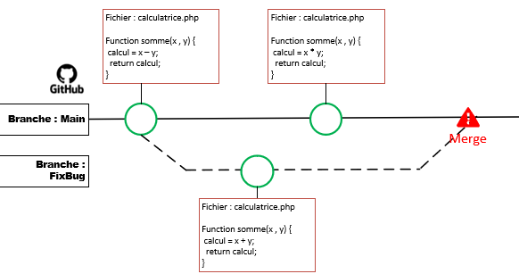
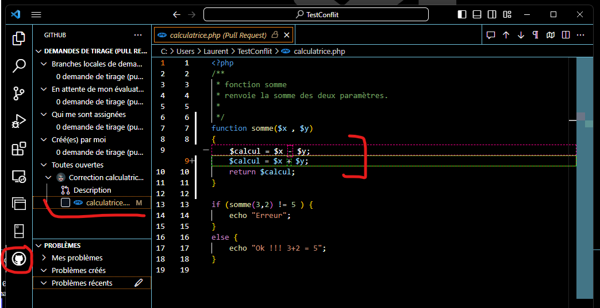

# TestConflit
## Exemple de conflit : 


la fonction somme du fichier calculatrice est bugéé sur la ligne 9 (- au lieu de +)
```php
function somme($x , $y) 
{
    $calcul = $x - $y;
    return $calcul;
}
```
## Comment produire un conflit
Depuis la branche main :
- Créer un branche "Fix"
- Corriger la fonction somme
- revenir sur la branche main
- modifier le fichier calculatrice.php en y intégrant un nouveau bug : remplacer le - par * (ligne 9)
- faire un commit
- passer sur la branche Fix
- faire un commit 
- puis merger la branche fix sur la branche Main

## Les conflits sont visible et peuvent être réglés dans Visual Studio Code
